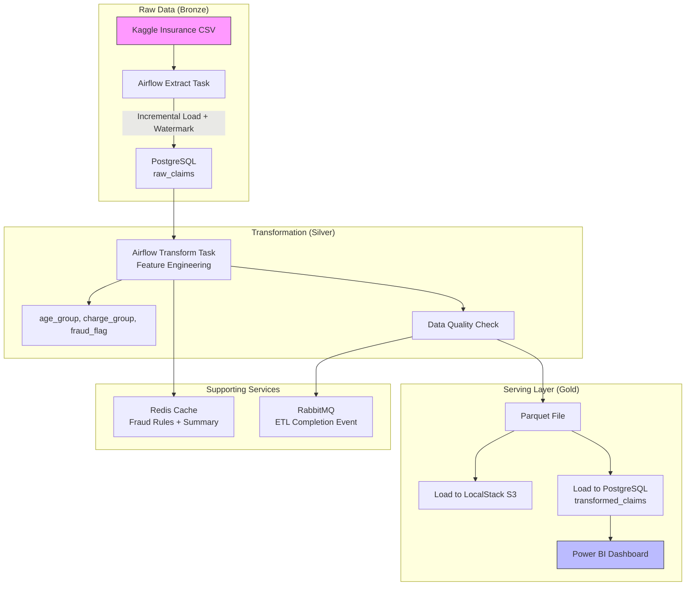
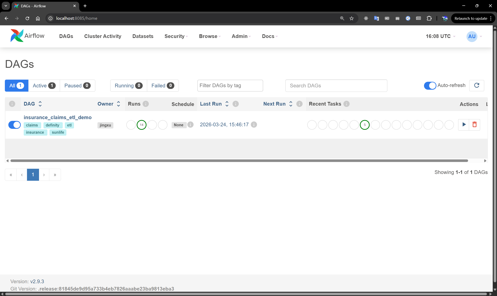
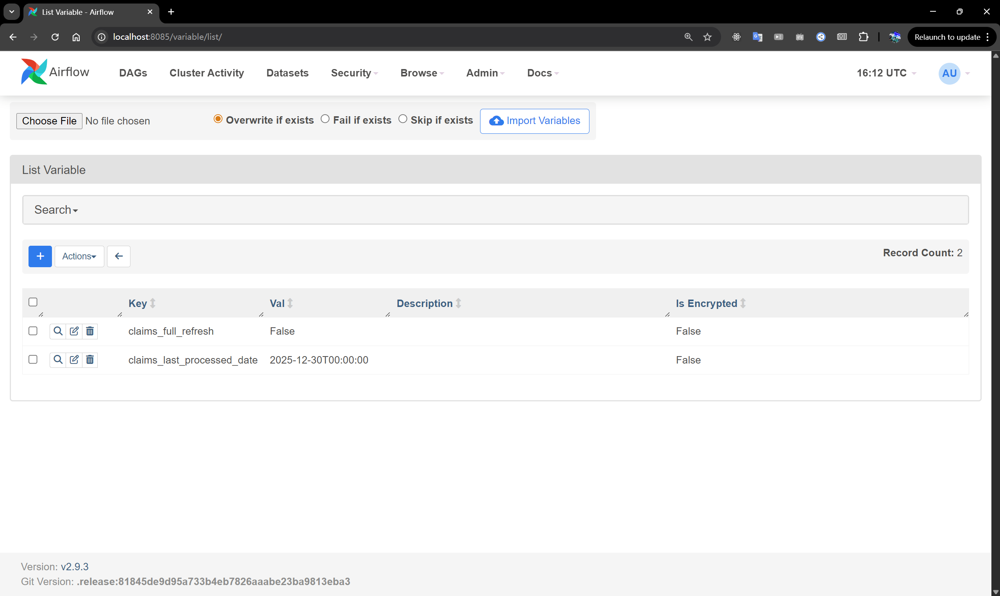
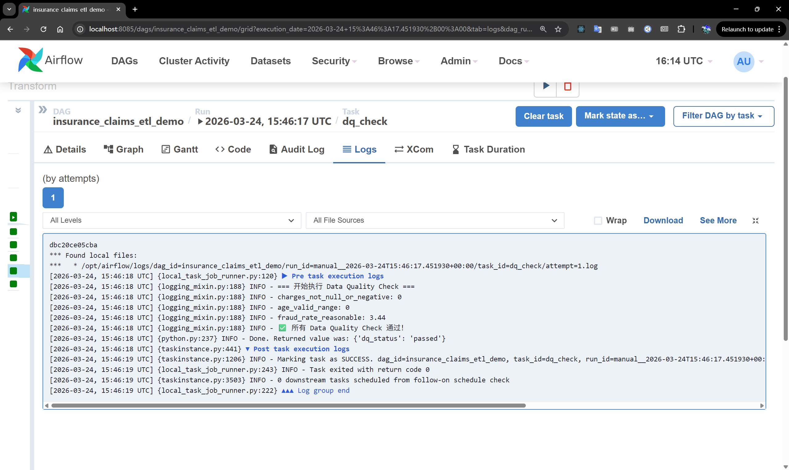
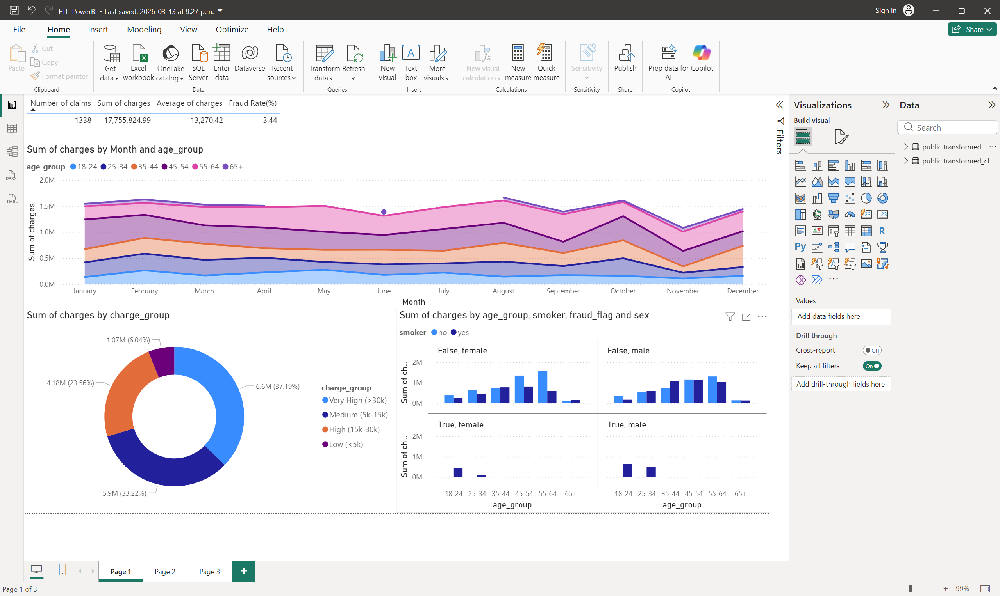
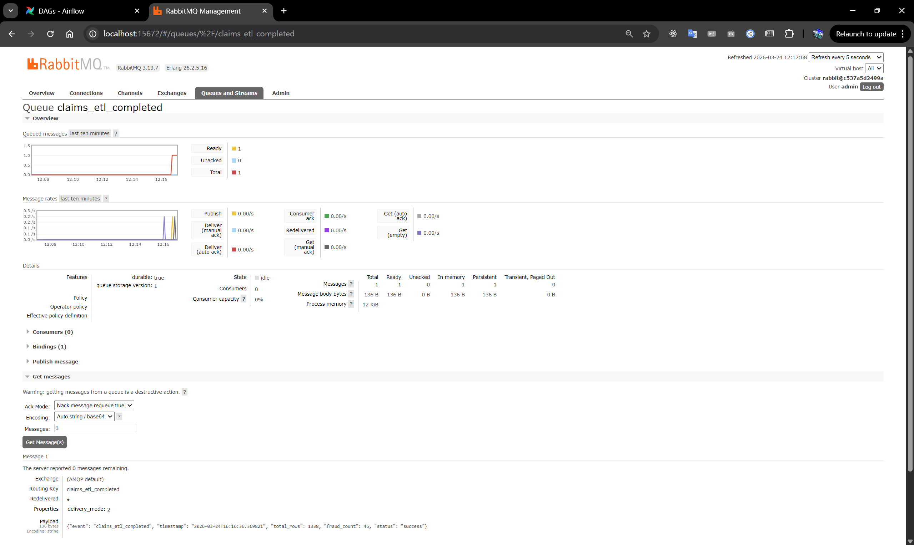

# Insurance Claims ETL Pipeline
This is a **production-grade ETL pipeline** designed for Canadian Property & Casualty (P&C) insurance claims processing. It demonstrates end-to-end data engineering capabilities suitable for roles at **Definity Financial**, **Sun Life**, and other major Canadian insurers.

The pipeline implements a **Medallion Architecture** (Bronze → Silver → Gold), supporting incremental loading, automated data quality validation, and event-driven processing — closely mirroring real-world insurance claims systems.


[](https://www.python.org/)
[](https://airflow.apache.org/)
[](https://opensource.org/licenses/MIT)

---
## Architecture & Screenshots


### Airflow DAG Overview


### Incremental Load & Watermark Management


### Data Quality Check Execution


### Power BI Dashboard


### RabbitMQ Event Publishing


---
## Key Engineering Features

- **Smart Incremental Load** using PostgreSQL watermark table and Airflow-managed state
- **Automated Data Quality Checks** integrated in Airflow (charges, age validation, fraud rate monitoring)
- Full Airflow DAG with clean task dependencies: Extract → Transform → Load → DQ Check → Cache & Publish
- Business-oriented feature engineering (`age_group`, `charge_group`, rule-based `fraud_flag`)
- Event-driven architecture with RabbitMQ event publishing
- Redis caching layer for fraud rules and real-time summary
- Parquet format + Simulated AWS S3 (LocalStack) + Redshift (PostgreSQL)
- Power BI dashboard directly connected to the transformed layer


---

## Tech Stack

- **Orchestration**: Apache Airflow 2.9
- **Language**: Python 3.11 + Pandas + SQLAlchemy
- **Database**: PostgreSQL 16 (Bronze & Silver layer)
- **Cloud Storage**: LocalStack (AWS S3 simulation)
- **Messaging & Cache**: RabbitMQ + Redis
- **Visualization**: Power BI Desktop
- **Others**: boto3, pika
---
## Project Structure

```bash
insurance-claims-etl-pipeline/
├── dags/
│   └── insurance_claims_etl_dag.py
├── scripts/
│   ├── extract.py              # Incremental Load logic
│   ├── transform.py
│   ├── load_to_s3.py
│   ├── dq_check.py             # Data Quality validation
│   ├── queue_publish.py        # RabbitMQ producer event
│   ├── queue_consumer.py       # RabbitMQ consumer event
│   ├── rabbitmq_config.py      # RabbitMQ configuration
│   ├── cache.py                # Redis cache
│   ├── transform.py        
│   ├── validate_raw.py        
│   └── create_tables.py
├── models/
│   └── claims_models.py
├── data/
│   ├── raw/
│   └── processed/
├── powerbi/
│   └── claims_dashboard.pbix
├── screenshots/
├── docker-compose.yml
├── requirements.txt
└── README.md
```

---

## How to Run (Quick Start)

1. Clone the repository

```bash
git clone https://github.com/yogurt98/insurance-claims-etl-pipeline.git
cd insurance-claims-etl-pipeline
```

2. Place Kaggle dataset
- Put insurance.csv into data/raw/insurance_claims_raw.csv

3. Start services
   ```bash
   docker compose up -d
4. Create database tablesBash
    ```bash
   docker compose exec airflow python scripts/create_tables.py

5. Configure run mode (in Airflow UI → Admin → Variables)
-   Set claims_full_refresh = True for first full load
-   Set to False for subsequent incremental loads

6. Open Airflow UI: http://localhost:8085 (admin / admin)
7. Enable & trigger the DAG: insurance_claims_etl_demo 
8. Verify:
-   PostgreSQL: transformed_claims table (~1338 rows)
-   S3 (LocalStack): s3://claims-bucket/transformed/claims.parquet
-   Local file: data/processed/transformed.parquet 
-   Power BI: connected to PostgreSQL
---
## Power BI Dashboard Highlights
Power BI Desktop is directly connected to the PostgreSQL transformed_claims table.

- Claims trend by month/quarter


- Age group distribution with fraud flag breakdown


- Charge group proportion analysis


- Age vs Charges scatter plot (colored by fraud_flag)


- Regional claims ranking


- Interactive slicers

## Business Value for Canadian Insurers

- Production-ready incremental processing to efficiently handle growing claims volume
- Built-in Data Quality enforcement for regulated insurance environments
- Event-driven design enabling real-time downstream processing (fraud detection, alerting)
- Simulated cloud environment (S3 + Redshift) aligning with Canadian insurance cloud migration trends
- End-to-end visibility from raw data to business insights via Power BI
- Fully Dockerized and easy to demonstrate in interviews
- 
## Future Improvements

- Advanced Data Quality with Great Expectations
- Airflow CeleryExecutor for distributed execution
- Integration with dbt (see separate dbt-insurance-risk-warehouse repo)
- CI/CD pipeline and monitoring/alerting

## License
MIT
